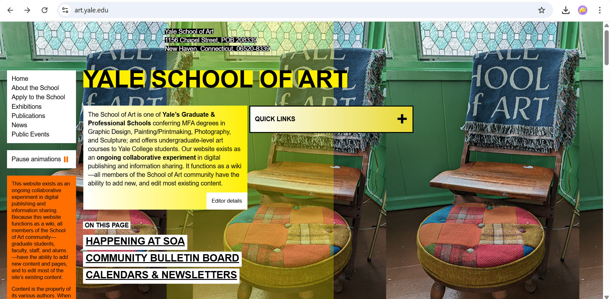
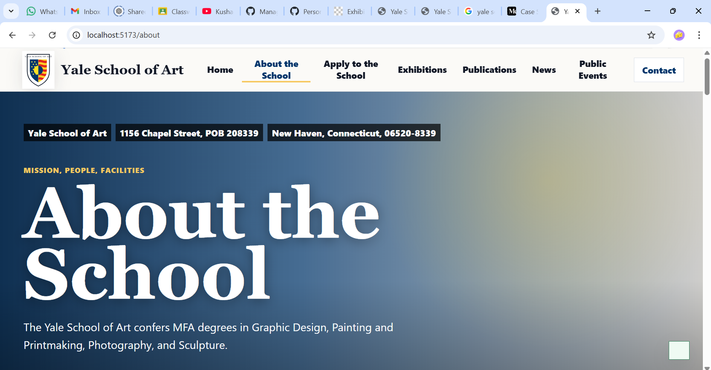

# 🎨 HCI Interface Redesign

<div align="center">

### Modern UI/UX redesign of the Yale School of Art website focused on improving usability, accessibility, navigation, and visual consistency.


<br>


</div>

---

# 📌 Overview

This project is a Human Computer Interaction (HCI) and Advanced Human Computer Interaction (AHCI) interface redesign of the Yale School of Art website.

The goal of the redesign was to improve the overall usability, readability, accessibility, navigation, and visual consistency of the original interface while preserving the artistic identity of the Yale School of Art website.

The redesigned version introduces a cleaner structure, better spacing, improved typography, modern navigation, responsive layouts, and more intuitive interaction patterns to create a professional and user-friendly experience.

---

# ❌ Problems in the Original Design

The original interface had a strong artistic identity, but several usability and accessibility issues negatively affected the user experience.

### Main Issues Identified

- Cluttered and visually overwhelming layout
- Poor readability due to overlapping text and images
- Inconsistent colors and typography
- Confusing navigation structure
- Unclear button hierarchy
- Excessive information density
- Lack of visual balance and spacing
- Weak accessibility and responsiveness

---

# ✅ Improvements Introduced

The redesigned interface focused on usability-first design while preserving the creative identity of the original platform.

### Key Improvements

- 🎨 Cleaner and modern visual layout
- 🧭 Consistent navigation bar
- 📄 Multi-page website structure
- 🔍 Improved readability and spacing
- 📱 Responsive interface design
- 🖱️ Better call-to-action buttons
- ♿ Improved accessibility and contrast
- 🖼️ Better image integration and visual hierarchy
- 🧠 User-friendly interaction flow

---

# 🏗️ Project Structure

```text
HCI-Interface-Redesign/
│
├── public/
├── src/
│   ├── components/
│   ├── pages/
│   ├── assets/
│   └── styles/
│
├── package.json
├── vite.config.ts
├── README.md
└── tsconfig.json
```

---

# 🛠️ Tech Stack

| Technology | Purpose |
|------------|----------|
| React | Frontend UI Development |
| TypeScript | Safer and structured code |
| CSS | Styling and responsiveness |
| Vite | Frontend build environment |
| Node.js | Local development server |
| Lucide React Icons | Modern UI icons |

---

# ⚙️ HCI Principles Applied

### ✅ Consistency
Consistent colors, typography, spacing, navigation, and button styling across all pages.

### 👁️ Visibility of System Status
Interactive elements and forms provide immediate visual feedback to users.

### 🧠 Recognition Rather Than Recall
Important sections remain accessible through persistent navigation and structured layouts.

### 🕹️ User Control and Freedom
Users can easily move between sections and pages using navigation menus and interactive controls.

### ✨ Aesthetic and Minimalist Design
The redesign reduces clutter and focuses attention on meaningful content.

### ♿ Accessibility
Improved readability, contrast, spacing, responsive layouts, and clear interaction elements.

### 🚫 Error Prevention
Clear labels, structured forms, and intuitive navigation reduce user confusion.

---

# 📸 Before vs After

## Before Redesign

The original Yale School of Art website featured a highly experimental artistic layout, but suffered from readability and usability issues.

<div align="center">

</div>

---

## After Redesign

The redesigned version introduces a cleaner layout, structured navigation, modern typography, and improved accessibility while preserving the original artistic identity.

<div align="center">

</div>

---

# 🚀 Installation

```bash
git clone https://github.com/roshaan-77/HCI-Interface-Redesign.git

cd HCI-Interface-Redesign

npm install

npm run dev
```

---

# ▶️ Running the Project

Start the development server:

```bash
npm run dev
```

Build the production version:

```bash
npm run build
```

Preview the production build:

```bash
npm run preview
```

---

# 🧩 Workflow Followed

1. Studied the original Yale School of Art website
2. Identified usability and accessibility problems
3. Designed a cleaner multi-page layout
4. Applied consistent visual hierarchy
5. Improved navigation and responsiveness
6. Added modern interaction components
7. Applied HCI and usability principles
8. Compared before and after interfaces

---

# 🚀 Future Improvements

- Dark mode support
- Improved animations and transitions
- Enhanced accessibility testing
- Mobile-first optimization
- Interactive exhibition galleries
- Improved search functionality

---

# 👨‍💻 Contributors

- Muhammad Roshaan
- Mujtaba Khan
- Affan Rehman

---

# 📜 License

This project is intended for educational and academic purposes.

---

<div align="center">

### ⭐ If you found this project interesting, consider giving it a star!

</div>
